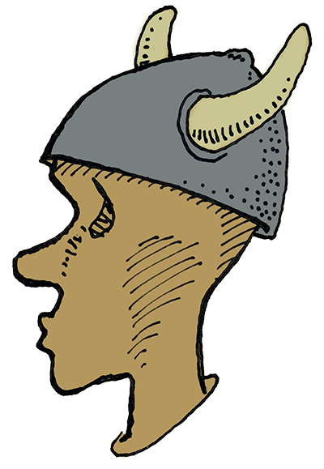

Norwegian types 🇳🇴
===

This repository contain code for
implementing common norwegian domain types.

## Organisasjonsnummer

[A library containing a type and tools to represent a Norwegian org number](./src/Skaar.Organisasjonsnummer).

## Fødselsnummer

[A library containing a type and tools to represent a Norwegian id number](./src/Skaar.Fodselsnummer).

## Kontonummer

[A library containing a type and tools to represent a Norwegian bank account number](./src/Skaar.Kontonummer).

